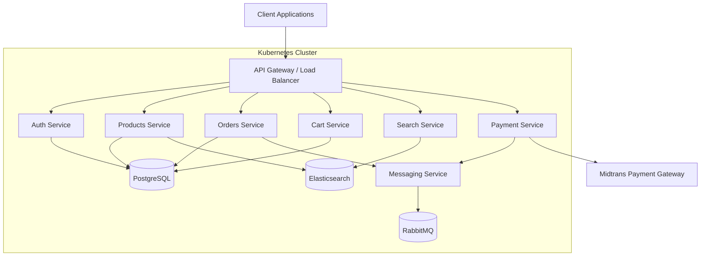
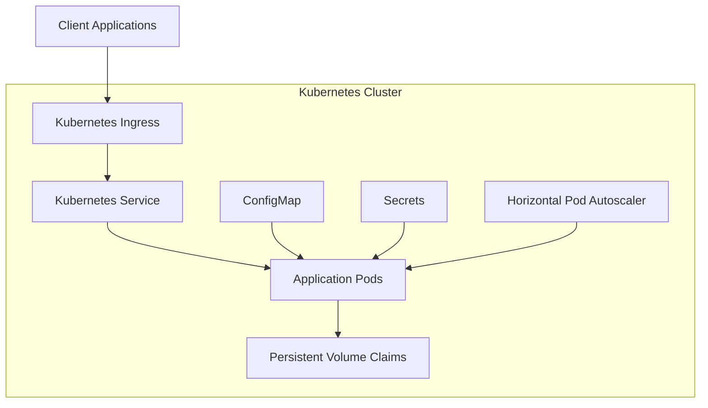
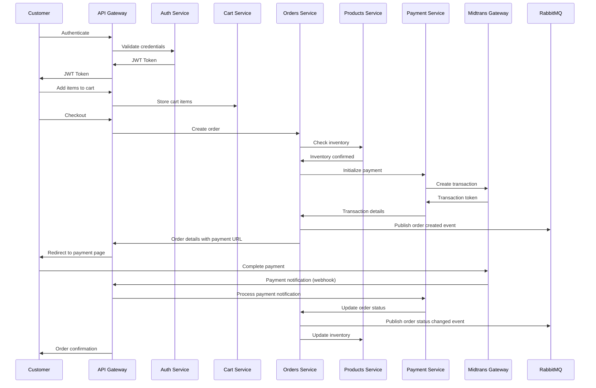

# E-commerce Backend

A production-ready e-commerce backend built with NestJS, PostgreSQL, RabbitMQ, Elasticsearch, Docker, Helm, and Kubernetes.

## Features

- **Products Management**: Create, update, delete, and search products
- **User Authentication**: JWT-based authentication with refresh tokens
- **Order Processing**: Complete order lifecycle management
- **Cart Management**: Shopping cart functionality
- **Payment Processing**: Integration with Midtrans for payments
- **Search**: Elasticsearch for powerful product search
- **Messaging**: RabbitMQ for asynchronous processing and notifications
- **Containerization**: Docker for consistent development and deployment
- **Orchestration**: Kubernetes for container orchestration
- **Package Management**: Helm charts for Kubernetes deployments

## Architecture

The e-commerce backend follows a microservices-inspired architecture while maintaining a monolithic deployment for simplicity.



### Infrastructure Architecture

The application is containerized with Docker and orchestrated with Kubernetes:



### Data Flow

The following diagram illustrates the data flow for a typical order process:



## Tech Stack

- **Backend Framework**: NestJS
- **Database**: PostgreSQL
- **Search Engine**: Elasticsearch
- **Message Broker**: RabbitMQ
- **Payment Gateway**: Midtrans
- **Containerization**: Docker
- **Orchestration**: Kubernetes
- **Package Management**: Helm

## Prerequisites

- Node.js (v18+)
- Docker and Docker Compose
- Kubernetes cluster (for production deployment)
- Helm (for production deployment)

## Local Development Setup

1. Clone the repository:

```bash
git clone https://github.com/fadhelmurphy/ecommerce-backend-boilerplate.git
cd ecommerce-backend
```

2. Create a `.env` file in the root directory with the following variables:

```
# Application
PORT=3000
NODE_ENV=development
JWT_SECRET=your_jwt_secret
JWT_EXPIRES_IN=1d

# Database
DB_HOST=localhost
DB_PORT=5432
DB_USERNAME=ecommerce
DB_PASSWORD=password
DB_NAME=ecommerce
DB_SSL=false

# Elasticsearch
ELASTICSEARCH_NODE=http://localhost:9200

# RabbitMQ
RABBITMQ_URL=amqp://localhost:5672
RABBITMQ_USER=guest
RABBITMQ_PASSWORD=guest

# Midtrans
MIDTRANS_SERVER_KEY=SB-Mid-server-XXXXXXXXXXXXXXXX
MIDTRANS_CLIENT_KEY=SB-Mid-client-XXXXXXXXXXXXXXXX
```

3. Start the development environment using Docker Compose:

```bash
docker-compose up -d
```

4. Install dependencies and run the application:

```bash
npm install
npm run start:dev
```

5. The API will be available at http://localhost:3000

6. Access the API documentation at http://localhost:3000/api/docs

## Running Tests

```bash
# Unit tests
npm run test

# E2E tests
npm run test:e2e

# Test coverage
npm run test:cov
```

## Production Deployment

### Using Docker

1. Build the Docker image:

```bash
docker build -t ecommerce-api:latest .
```

2. Run the container:

```bash
docker run -p 3000:3000 --env-file .env ecommerce-api:latest
```

### Using Kubernetes and Helm

1. Set up your Kubernetes cluster (e.g., using GKE, EKS, AKS, or Minikube)

2. Create a namespace for the application:

```bash
kubectl apply -f k8s/namespace.yaml
```

3. Create secrets (replace placeholders with actual values):

```bash
kubectl apply -f k8s/secret.yaml
```

4. Deploy using Helm:

```bash
helm install ecommerce ./helm/ecommerce \
  --namespace ecommerce \
  --set secrets.DB_USERNAME=base64_encoded_username \
  --set secrets.DB_PASSWORD=base64_encoded_password \
  --set secrets.JWT_SECRET=base64_encoded_jwt_secret \
  --set secrets.MIDTRANS_SERVER_KEY=base64_encoded_midtrans_server_key \
  --set secrets.MIDTRANS_CLIENT_KEY=base64_encoded_midtrans_client_key \
  --set secrets.RABBITMQ_USER=base64_encoded_rabbitmq_user \
  --set secrets.RABBITMQ_PASSWORD=base64_encoded_rabbitmq_password
```

5. Verify the deployment:

```bash
kubectl get pods -n ecommerce
```

## Midtrans Integration

This project uses Midtrans as the payment gateway. To set up Midtrans:

1. Create an account at [Midtrans](https://midtrans.com/)
2. Get your Server Key and Client Key from the Midtrans Dashboard
3. Add these keys to your environment variables:
   - `MIDTRANS_SERVER_KEY`: Your Midtrans Server Key
   - `MIDTRANS_CLIENT_KEY`: Your Midtrans Client Key

For development, you can use the Midtrans Sandbox environment.

### Payment Flow

1. When an order is created, a payment transaction is initiated with Midtrans
2. The customer is redirected to the Midtrans payment page
3. After payment, Midtrans sends a webhook notification to your API
4. The API updates the order status based on the payment result

## API Documentation

Once the application is running, you can access the Swagger documentation at:

- Local: http://localhost:3000/api/docs
- Production: https://api.ecommerce.example.com/api/docs

## Project Structure

```
src/
├── auth/                 # Authentication module
├── cart/                 # Shopping cart module
├── config/               # Configuration
├── health/               # Health checks
├── messaging/            # RabbitMQ integration
├── orders/               # Order processing
├── payment/              # Payment processing (Midtrans)
├── products/             # Products management
├── search/               # Elasticsearch integration
├── users/                # User management
├── app.module.ts         # Main application module
├── main.ts               # Application entry point
```

## Contributing

1. Fork the repository
2. Create your feature branch (`git checkout -b feature/amazing-feature`)
3. Commit your changes (`git commit -m 'Add some amazing feature'`)
4. Push to the branch (`git push origin feature/amazing-feature`)
5. Open a Pull Request

## License

This project is licensed under the MIT License - see the LICENSE file for details.
